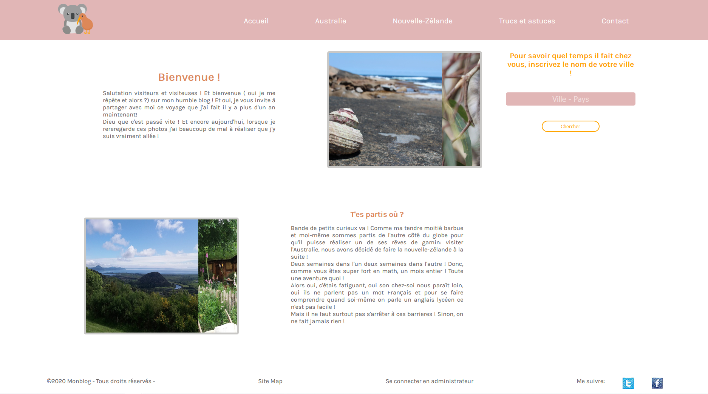

# Mon blog (Examen Kercode)

### AUTEUR : 

Stéphanie Lemaitre, éléve Kercode alias @Slemaitre56

### ETAT DU PROJET : 

En cours..à suivre.

### DESCRIPTION : 

Projet final pour l'obtention du dîplome de Developpeur Web. 

Sujet : Simple blog proposant :

* Une api Rest OpenWeatherMap pour voir la méteo d'une ville/Pays.

* Des onglets avec des articles sur l'Australie, Nouvelle-Zelande, les trucs et astuces pour voyager.

* Un moyen de publier, supprimer les articles en mode admin.

              
              
### LANGAGES : 

* HTML 
* CSS 
* JAVASCRIPT 
* JQUERY
* AJAX
* API

### UTILISATION : 

Usage classique et simple du blog.
* Faire un git clone ou directement télècharger le dossier
* La base de donnée est dans le dossier database.
* Vous pouvez acceder à la partie admin en faisant : base de url /admin
* Une fois sur la page de connexion : admin / admin56
* Vous pouvez créer, modifier, supprimer un article.
              
Utilisation de code climate

### VERSION : 

1.0 2020

### CONTRIBUTION : 

* Ensemble de la classe Kercode 4

* Professeurs du Greta de Vannes

